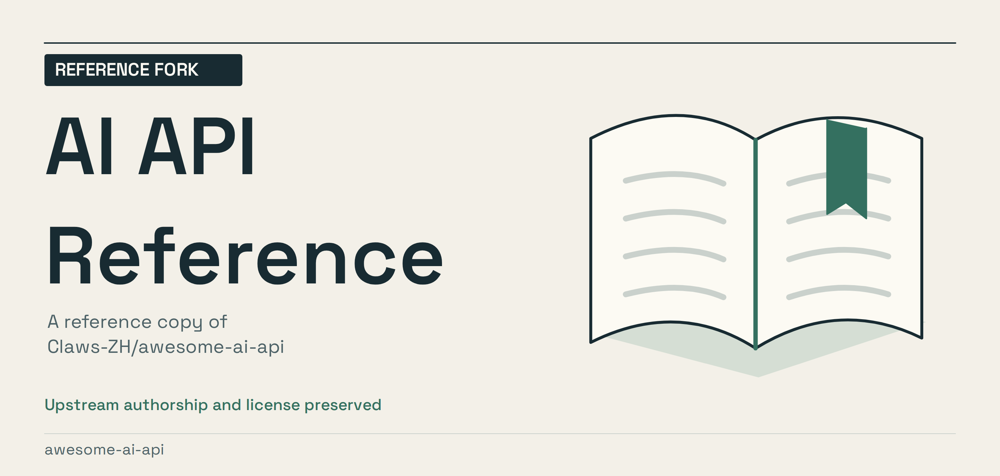
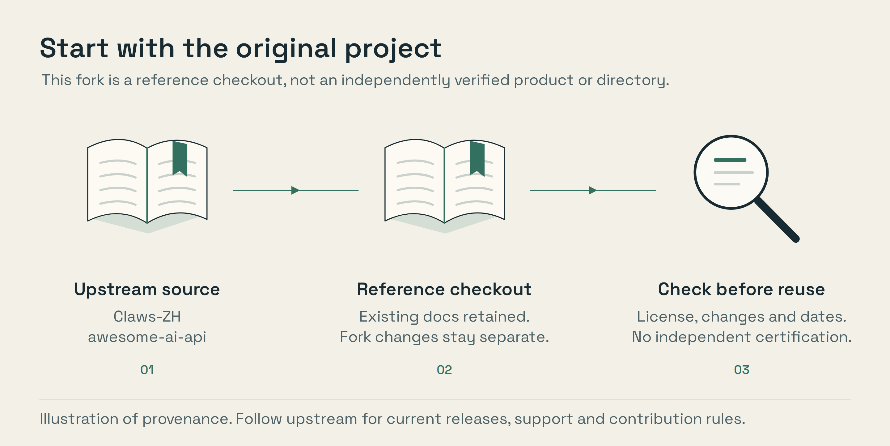

<!-- repository-presentation: reference-fork -->

# AI API Reference / reference fork

This repository is a fork of **[Claws-ZH/awesome-ai-api](https://github.com/Claws-ZH/awesome-ai-api)**. The original project's
authors, licensing and contribution rules still apply. This presentation does
not claim the upstream work as an original project.

- Start with the [upstream repository](https://github.com/Claws-ZH/awesome-ai-api) for its current documentation.
- Review this fork's history before assuming it is identical to the latest upstream branch.
- Check licenses and current service behavior before using code, providers or resources.

*Provenance illustration, not an execution trace. [Editable artwork](scripts/artwork/README.md).*

## Existing project documentation

The documentation below is preserved from this fork's previous public revision.
Counts, service claims, badges and benchmark statements in that material are
not independently certified by this presentation pass. No upstream release,
security or availability guarantee is being added.

---

# awesome-ai-api

> The world's largest open-source hub for AI API gateways & reseller reviews.  
> Curated · community-driven · fully transparent · **every gateway probed daily**.

  
  
  
  <!-- STATS:BEGIN -->
  
  
  
  <!-- STATS:END -->

  <a href="./README.zh-CN.md">🇨🇳 中文</a> · <b>English</b> · <a href="https://mackding.github.io/awesome-ai-api/">🌐 Live site</a>

---

## What makes us different

We don't just list gateways — **we probe every one of them daily** for a real OpenAI-compatible `/v1/models` endpoint. No `200 OK on the homepage` inflation.

- 🔌 **Ground-truth API detection** — every 🔌 badge = endpoint confirmed live
- 🔍 **Transparency** — no paid placement; [raw data](./data/gateways.json) is Git-history-tracked
- 🌏 **Global** — bilingual (EN/中文), covers Western + Chinese markets
- 🛠 **Developer-first** — structured JSON, daily history snapshots, PR-editable
- 🤝 **Community-driven** — pricing & reviews by people who actually pay for these services

---

## 🎯 Quick Picks

Confused by 200+ gateways? Start here.

<!-- QUICKPICKS:BEGIN -->
| Use case | Recommendation | Why |
|---|---|---|
| 🌐 **Global, one API for all models** | [OpenRouter](https://openrouter.ai) | Pioneer of the pattern; most stable, highest fees |
| 👨‍💻 **Best Claude Code in China** | [PackyAPI](https://www.packyapi.com) | Claude-Code native, active upstream, ¥1/sample |
| 🏢 **Enterprise / invoices** | [柏拉图AI](https://api.bltcy.ai) · [云雾](https://yunwu.ai) | Long-running, multi-region, invoices, DeepSeek/MidJourney too |
| 💰 **Cheap Claude (accept risk)** | [Terminal.Pub](https://terminal.pub) · [XcodeBest](https://xcode.best) | ~0.15% of official; new = verify before topping up |
| 🆓 **Free trial credit** | [AnyRouter](https://anyrouter.dev) · [发现AI](https://www.findcg.com) | Credits on signup, no card |
| 🏠 **Self-hosted** | [One API](https://github.com/songquanpeng/one-api) · [New API](https://github.com/Calcium-Ion/new-api) | OSS; the engine 60% of the CN list runs on |
| ⚡ **Inference-only (Llama/Qwen/DeepSeek)** | [Groq](https://groq.com) · [Together](https://together.ai) · [Fireworks](https://fireworks.ai) | Not resellers; own GPUs; US cards only |
| 🌯 **Multi-modal (video/music/image)** | [神马AI](https://api.whatai.cc) · [302.AI](https://302.ai) | MidJourney, Kling, Suno, PPT generators |
<!-- QUICKPICKS:END -->

> ⚠️ **Never pre-pay large amounts.** This industry has weekly rug-pulls. Top up ¥10 first, validate quality, then consider going up.

---

## 💚 Support this project

This repo is free, ad-free, and has no paid placement. If the leaderboard saved you from topping up a rug-pull, consider chipping in:

- **USDT (any EVM chain — ERC20 / BSC / Polygon / Arbitrum / Base / Optimism):**  
  `0xa5c74e7D3f0c8f1c0d7A395A6B7861Ab0A64cA7F`
- ⭐ **Star the repo** — also helps a lot; boosts us in GitHub trending.
- 📝 **Open a PR** with a gateway report — the most valuable contribution.

> 💡 **Double-check the chain before sending.** Sending from an exchange? Withdraw on **ERC20 / BSC / Polygon / Arbitrum / Base / Optimism**. **Do NOT use TRC20** (TRON) — that address doesn't exist on Tron.

---

## Table of Contents

- [🏆 Full Leaderboard](#-full-leaderboard)
- [❓ FAQ](#-faq)
- [📊 Categories](#-categories)
- [📝 Reviews](#-reviews)
- [⚠️ Blacklist](#️-blacklist)
- [🧪 Benchmark](#-benchmark)
- [🤝 Contributing](#-contributing)
- [📜 License](#-license)

---

## 🏆 Full Leaderboard

Auto-generated daily at **10:00 SGT (UTC+8)** from live probes. See [methodology](./reviews/methodology.md) · [history](./data/history/) · [raw data](./data/gateways.json).

**🔌 = confirmed `/v1/models` endpoint (real API, not just a marketing page).**

<b>📊 Click to expand the full leaderboard</b>

<!-- LEADERBOARD:BEGIN -->
_Last updated: 2026-08-17 10:57 (SGT)_

**Total: 191 gateways** · 🔌 **91 with confirmed `/v1/models` endpoint** · 🟢 120 Verified · 🟡 4 Probable · 🧰 7 OSS · 🔍 60 Needs review

**Top engines detected:** `new-api` × 36 · `one-api` × 15 · `litellm` × 4 · `openrouter` × 2 · `dify` × 2

| # | Gateway | Region | API | Models | Engine | Payment | Score | Latency | Tier |
|---|---------|--------|-----|--------|--------|---------|-------|---------|------|
| 🥇 | [Avian](https://avian.io) | global | 🔌 | **11 models** | — | — | 9.9 | 115 ms | 🟢 Verified |
| 🥈 | [AIHubMix](https://aihubmix.com) | global | 🔌 | **397 models** | one-api | — | 9.9 | 470 ms | 🟢 Verified |
| 🥉 | [呆呆兽中转站｜Claude、Codex、GLM、Kimi 折扣 API](https://www.ddshub.cc) | cn | 🔌 | claude, gpt, anthropic | — | alipay, wechat, card | 9.9 | 793 ms | 🟢 Verified |
| 4 | [BUZZ](https://buzzai.cc) | global | 🔌 | claude, gpt, gemini | one-api | card | 9.9 | 828 ms | 🟢 Verified |
| 5 | [APIMart (apimart.ai)](https://apimart.ai) | global | 🔌 | claude, gpt, gemini | one-api | alipay, wechat, card, crypto | 9.9 | 1341 ms | 🟢 Verified |
| 6 | [Featherless](https://featherless.ai) | global | 🔌 | gpt, openai, deepseek | one-api | — | 9.8 | 225 ms | 🟢 Verified |
| 7 | [api.vveai.com](https://api.vveai.com) | cn | 🔌 | claude, gpt, gemini | — | — | 9.8 | 266 ms | 🟢 Verified |
| 8 | [ePhone AI](https://api.ephone.ai) | cn | 🔌 | claude, gpt, gemini | — | — | 9.8 | 268 ms | 🟢 Verified |
| 9 | [apipro.maynor1024.live](https://apipro.maynor1024.live) | global | 🔌 | claude, gpt, gemini | — | — | 9.8 | 283 ms | 🟢 Verified |
| 10 | [TiMi CC](https://timicc.com) | cn | 🔌 | gpt, openai, qwen | — | wechat, card | 9.8 | 387 ms | 🟢 Verified |
| 11 | [api.v3.cm](https://api.v3.cm) | cn | 🔌 | claude, gpt, gemini | — | — | 9.8 | 424 ms | 🟢 Verified |
| 12 | [api.v36.cm](https://api.v36.cm) | cn | 🔌 | claude, gpt, gemini | — | — | 9.8 | 549 ms | 🟢 Verified |
| 13 | [api.gpt.ge](https://api.gpt.ge) | cn | 🔌 | claude, gpt, gemini | — | — | 9.8 | 590 ms | 🟢 Verified |
| 14 | [jeniya.cn](https://jeniya.cn) | cn | 🔌 | claude, gpt, chatgpt | — | — | 9.8 | 1418 ms | 🟢 Verified |
| 15 | [Doro AI](https://doro.lol) | cn | 🔌 | claude, gpt, gemini | new-api | — | 9.8 | 1498 ms | 🟢 Verified |
| 16 | [便携AI聚合API](https://api.bianxieai.com) | cn | 🔌 | claude, gemini, openai | new-api | — | 9.8 | 1505 ms | 🟢 Verified |
| 17 | [api.timebackward.com](https://api.timebackward.com) | cn | 🔌 | claude, gpt, gemini | — | — | 9.7 | 445 ms | 🟢 Verified |
| 18 | [api-gptgod-work](https://api.gptgod.work) | global | 🔌 | **336 models** | — | — | 9.7 | 590 ms | 🟢 Verified |
| 19 | [API Market (api.302ai.com)](https://api.302ai.com) | global | 🔌 | gpt, gemini, anthropic | — | — | 9.7 | 880 ms | 🟢 Verified |
| 20 | [ClaudeCN](https://claudecn.top) | cn | 🔌 | claude, gpt, gemini | — | — | 9.7 | 981 ms | 🟢 Verified |
| 21 | [API Market (api.302ai.cn)](https://api.302ai.cn) | global | 🔌 | gpt, gemini, anthropic | — | — | 9.7 | 2540 ms | 🟢 Verified |
| 22 | [api.cursorai.art](https://api.cursorai.art) | global | 🔌 | claude, gpt, chatgpt | — | — | 9.6 | 107 ms | 🟢 Verified |
| 23 | [api-chatfire-cn](https://api.chatfire.cn) | cn | 🔌 | claude, gemini, openai | — | — | 9.6 | 130 ms | 🟢 Verified |
| 24 | [api.onechats.top](https://api.onechats.top) | cn | 🔌 | claude, gemini, openai | new-api | — | 9.6 | 192 ms | 🟢 Verified |
| 25 | [PackyAPI (PackyCode)](https://www.packyapi.com) | cn | 🔌 | claude, gpt, gemini | — | wechat | 9.6 | 222 ms | 🟢 Verified |
| 26 | [new.yunai.link](https://new.yunai.link) | cn | 🔌 | claude, gemini, openai | — | — | 9.6 | 251 ms | 🟢 Verified |
| 27 | [Aiberm](https://aiberm.com) | global | 🔌 | claude, gemini, openai | — | — | 9.6 | 281 ms | 🟢 Verified |
| 28 | [api-holdai-top](https://api.holdai.top) | cn | 🔌 | claude, gemini, openai | — | — | 9.6 | 283 ms | 🟢 Verified |
| 29 | [柏拉图AI_API中转站 (api.bltcy.ai)](https://api.bltcy.ai) | cn | 🔌 | claude, gpt, openai | — | — | 9.6 | 284 ms | 🟢 Verified |
| 30 | [apirouter.ai](https://apirouter.ai) | cn | 🔌 | claude, gemini, openai | new-api | — | 9.6 | 298 ms | 🟢 Verified |
| 31 | [api-deerapi-com](https://api.deerapi.com) | cn | 🔌 | claude, gemini, openai | — | — | 9.6 | 343 ms | 🟢 Verified |
| 32 | [api.soruxgpt.com](https://api.soruxgpt.com) | cn | 🔌 | claude, gemini, openai | new-api | — | 9.6 | 420 ms | 🟢 Verified |
| 33 | [onetoken.one](https://onetoken.one) | cn | 🔌 | claude, gemini, openai | new-api | — | 9.6 | 460 ms | 🟢 Verified |
| 34 | [api.aipaibox.com](https://api.aipaibox.com) | cn | 🔌 | claude, gemini, openai | new-api | — | 9.6 | 927 ms | 🟢 Verified |
| 35 | [DeerAPI (小鹿API)](https://deerapi.com) | cn | 🔌 | claude, gemini, openai | — | — | 9.6 | 999 ms | 🟢 Verified |
| 36 | [LingxiCode](https://new.050602.xyz) | cn | 🔌 | claude, gemini, openai | new-api | — | 9.6 | 1323 ms | 🟢 Verified |
| 37 | [marting.pro](https://marting.pro) | global | 🔌 | gpt, chatgpt | — | — | 9.5 | 137 ms | 🟢 Verified |
| 38 | [Yuegle API](https://api.yuegle.com) | cn | 🔌 | claude, gpt, gemini | — | — | 9.5 | 295 ms | 🟢 Verified |
| 39 | [comfly](https://ai.comfly.chat) | global | 🔌 | gpt, openai | — | — | 9.5 | 765 ms | 🟢 Verified |
| 40 | [Tokencloud.ai](https://ai.tokencloud.ai) | global | 🔌 | — | — | wechat | 9.5 | 1262 ms | 🟢 Verified |
| 41 | [zen-ai.top](https://zen-ai.top) | cn | 🔌 | openai | — | — | 9.4 | 80 ms | 🟢 Verified |
| 42 | [API Management](https://sparkcode.top) | cn | 🔌 | openai | — | — | 9.4 | 82 ms | 🟢 Verified |
| 43 | [LaoZhang API](https://api.laozhang.ai) | global | 🔌 | gpt | — | — | 9.4 | 247 ms | 🟢 Verified |
| 44 | [GPTNB ONEAPI](https://oneapi.gptnb.ai) | cn | 🔌 | gpt | — | — | 9.4 | 279 ms | 🟢 Verified |
| 45 | [api.aikeji.vip](https://api.aikeji.vip) | cn | 🔌 | openai | — | — | 9.4 | 301 ms | 🟢 Verified |
| 46 | [Unified API](https://unifiedapi.cloud) | cn | 🔌 | openai | — | — | 9.4 | 795 ms | 🟢 Verified |
| 47 | [api-featherless-ai](https://api.featherless.ai) | global | 🔌 | — | — | — | 9.3 | 73 ms | 🟢 Verified |
| 48 | [chatapi.onechats.top](https://chatapi.onechats.top) | global | 🔌 | — | new-api | — | 9.3 | 133 ms | 🟢 Verified |
| 49 | [api.nekoapi.com](https://api.nekoapi.com) | global | 🔌 | — | new-api | — | 9.3 | 169 ms | 🟢 Verified |
| 50 | [zerocode.sbs](https://zerocode.sbs) | global | 🔌 | — | new-api | — | 9.3 | 193 ms | 🟢 Verified |

> Top 50 shown. See [`data/_leaderboard.md`](data/_leaderboard.md) for the full list of 191 gateways.

<!-- LEADERBOARD:END -->

> 📌 **Want your gateway listed?** Open a PR with a filled [gateway template](./gateways/_template.md). We accept any provider that meets our [listing criteria](./CONTRIBUTING.md#listing-criteria).

---

## ❓ FAQ

<b>What exactly is an "AI API gateway" or "中转站"?</b>

A third-party service that exposes Claude, GPT, Gemini, DeepSeek, Qwen, and other frontier LLMs through a **single OpenAI-compatible HTTP API**. Most of them sit in front of the official providers and resell capacity, often at discounted prices, with friendlier payment options (WeChat/Alipay), or with extra features (rate-limit pooling, routing, logging, invoices).

<b>How is this different from OpenRouter's /models page, helpaio.com, or apicompare.best?</b>

- **OpenRouter** only lists gateways running inside OpenRouter's own routing graph. We list **every relay we can find**, including the dozens of small CN players.
- **helpaio.com** is a blog with human-written reviews. We publish **machine-verified data** (live `/v1/models` probes, engine fingerprints, uptime) alongside reviews.
- **apicompare.best** compares prices. We compare **reachability, authenticity, and stability** — cheaper doesn't help if the gateway disappears next week.

<b>How do you decide the leaderboard score?</b>

We combine: reachability (HTTP 2xx), confirmed `/v1/models` endpoint, real-model count, model-keyword density on the landing page, latency, and 30-day uptime from our daily snapshots. The formula lives in [`scripts/generate_leaderboard.py`](./scripts/generate_leaderboard.py) — no black box.

<b>Is this a paid directory? Who pays you to be listed?</b>

**No one.** There is zero paid placement. Listings are either auto-discovered or PR'd by the community. The repo is MIT-licensed and ad-free. If the leaderboard helped you, consider [supporting the project](#-support-this-project).

<b>Can I trust the top-ranked gateways with large amounts of money?</b>

**No.** This industry sees weekly rug-pulls. A high score means a gateway is *currently* reachable, has a real API, and has been stable for 30 days — **not** that it is solvent or will still be online next month. Always top up small amounts first (≤ US$2), validate model quality, and scale slowly.

<b>I got scammed by a gateway. How do I report it?</b>

Open a [GitHub Discussion](https://github.com/MackDing/awesome-ai-api/discussions) under the `Reports` category with public evidence (screenshots, transaction IDs, Telegram group links). Two independent reports + a 14-day operator response window = the gateway lands on [`data/blacklist.json`](./data/blacklist.json).

<b>How do I add my gateway?</b>

Add the URL to [`data/candidates.txt`](./data/candidates.txt), then (optionally) add a human-curated `name`, `region`, and `verdict` to [`data/sites.yaml`](./data/sites.yaml). Open a PR. The daily cron will pick it up.

<b>Do you support non-OpenAI-compatible APIs (raw Anthropic, raw Gemini)?</b>

We primarily probe `/v1/models` (OpenAI-compatible), because it's the lingua franca. Gateways that only expose raw Anthropic or Gemini endpoints can still be listed via `data/sites.yaml` with a `verdict: likely_relay` override and a `note` explaining the protocol.

---

## 📊 Categories

### By Target Market

- 🌍 [Global Gateways](./data/by-region.md#global) — OpenRouter, Together AI, Groq, Fireworks
- 🇨🇳 [China Gateways](./data/by-region.md#china) — Road2All, DeepBricks, AiHubMix, OhMyGPT
- 🏠 [Self-Hosted](./data/by-region.md#self-hosted) — One API, NewAPI, LiteLLM

### By Specialty

- 🤖 [Claude Code Compatible](./data/by-feature.md#claude-code) — Services fully supporting Claude Code CLI
- ⚡ [Low-Latency](./data/by-feature.md#low-latency) — Sub-500ms TTFT
- 💰 [Best-Price](./data/by-feature.md#best-price) — Discounted vs. official rates
- 🔒 [Privacy-First](./data/by-feature.md#privacy) — No data retention / on-prem

### By Payment

- 💳 [Alipay/WeChat](./data/by-payment.md#cn) — For Chinese users
- 💳 [Credit Card](./data/by-payment.md#card) — International
- ₿ [Crypto](./data/by-payment.md#crypto) — Anonymous payment support

---

## 📝 Reviews

Deep-dive reviews and benchmark reports:

- 📊 [2026 Q2 Gateway Benchmark](./reviews/2026-Q2-benchmark.md) *(coming soon)*
- 🔬 [Claude Code Gateway Shootout](./reviews/claude-code-shootout.md) *(coming soon)*
- 💸 [Price Analysis: Official vs Gateway](./reviews/pricing-analysis.md) *(coming soon)*
- 🧪 [Methodology](./reviews/methodology.md)

---

## ⚠️ Blacklist

Gateways that have been flagged for serious issues (rug-pulls, data leaks, fake models).

See [blacklist.md](./data/blacklist.md) for the current list and evidence archive.

> If you've been affected, please open a GitHub Discussion with evidence. We review reports transparently.

---

## 🧪 Benchmark

We run periodic benchmarks testing:

- **Latency** (TTFT, total response time)
- **Throughput** (tokens/sec)
- **Reliability** (uptime %)
- **Accuracy** (model behavior matches official?)
- **Pricing consistency** (quoted vs. billed)

See [`scripts/benchmark.py`](./scripts/benchmark.py) for the test harness. Results in [`data/benchmarks/`](./data/benchmarks/).

---

## 🤝 Contributing

We welcome PRs from users, gateway operators, and researchers. See [CONTRIBUTING.md](./CONTRIBUTING.md).

**Quick ways to help:**
- ✏️ Update a gateway's pricing or model list
- 📝 Submit a new gateway (use the [template](./gateways/_template.md))
- 🚨 Report a scam or outage
- 🧪 Submit benchmark data
- 🌐 Improve translations

---

## 📜 License

Content is released under the [MIT License](./LICENSE). Attribution appreciated but not required.

---

## 🙏 Acknowledgments

Inspired by [apicompare.best](https://apicompare.best), [helpaio.com/transit](https://www.helpaio.com/transit), and [trustmrr.com](https://trustmrr.com) — each taught us one piece of the puzzle: **price data, content depth, and verified trust**. We combine them with GitHub-native openness.

---

  <em>Built by <a href="https://github.com/MackDing">Mack Ding</a> and contributors · Made for the global OPC community</em>

---

## 🦞 OPC Ecosystem

> Built by [@MackDing](https://github.com/MackDing) — One-Person Company infrastructure powered by AI agents.

| Project | What it does |
|---------|-------------|
| [**opc.ren**](https://opc.ren) | OPC founder hub — tools, signals, community |
| [**CodexClaw**](https://github.com/MackDing/CodexClaw) | Telegram bot for remote Codex access with MCP + subagent routing |
| [**awesome-ai-api**](https://github.com/MackDing/awesome-ai-api) | Leaderboard of 200+ AI API gateways & relays |
| [**claude-context-health**](https://github.com/MackDing/claude-context-health) | Diagnose & fix Claude Code session degradation |
| [**opc-daily-signal**](https://github.com/MackDing/opc-daily-signal) | AI-powered daily decision intelligence for OPC founders |
| [**doc-preprocess-hub**](https://github.com/MackDing/doc-preprocess-hub) | Enterprise document preprocessing — MinerU + docling |
